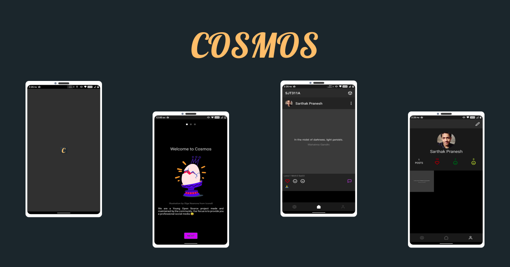

# Cosmos - Boxed Social Media Platform

 

## What is Cosmos?

Cosmos is an open source Social Media platform. The project aims to provide a dedicated box like platform for it's users where they can have dedicated spaces for their  friends, family, work circle, etc. We achieve this by utilizing Boxes. Inside of each box you add users by there email that are relevant to that box. This helps you focus and share content in groups (boxes) where that content would matter the most.

 

## Download 
Latest Release: [Cosmos](https://github.com/sarthakpranesh/cosmos.ReactNative/releases)

 

## For Developers
Make sure you have React Native and Android Studio development environment setup, if not then you can follow this [guide](https://reactnative.dev/docs/environment-setup) to do so ( make sure you setup `React Native CLI` )

To build the app locally for development
1. Fork this repo and clone it locally
2. `yarn install`
3. `yarn start` - starts metro bundler
4. `yarn android` - will build and open app on emulator or any attached android device.

For contributing to this project make sure you read the [Contribution Guide](https://github.com/sarthakpranesh/Cosmos/blob/master/CONTRIBUTING.md)

 

## Features Implemented
|Feature Gist           |How to!            |Helps With         | 
|---	|---	|---	|
|Box |Created separate boxes filled with people who are interested in a common topic |As the main aim of the project is to try to provide a more professional social platform, it is necessary we take steps that lets a common audience see a particular set of content.  |
|Reactions |React to posts by clicking icons as per your wish |Lets the users react to posts to showcase their agreement or disagreement from the post, currently there are three types of reaction a user can give (Like, Meh, Sad) |
|Double tap to like |Click on a post image two time in a short duration to like the post |Users get a quick like feature which they can use more easily to like posts. Adds on to the user experience |
|Comments |Click the message/comment icon on the right of the post and start a discussion |Reactions sometime aren't able to disclose what an individual might have to share with others on the topic, hence they can leave a comment let other know what they feel or want to share |
|Cartoon Friends |They help the user get started with the app and provide valuable information in a cute and innovative manner |Error, inactivity or onboarding information might get very boring for the end user at times. Cartoon friends help the user stay involved and pass this required message to the user. |
|Minimal Notification |You get notifications from default |All new posts in a current box give notifications  |
|Sharing Api   |Click the share button on posts    |Showcases multiple options to the user for sharing their post links with different platforms or people   |
|Deep linking   |Share Cosmos post links on your other social media handles     |It allows the user to share links to posts on Cosmos to other platforms, and these links when pressed are handled by the Cosmos app   |

 

## Future Features Plans
Review the `Latest Build` and let us know where we can improve, see future plans below and if you don't find your issue/feature request listed, open an issue.

|Feature Gist           |How to!            |Helps With         | 
|---	|---	|---	|
|Minimal Notifications   |The app would trigger notifications on specific events    |Lets the user know about the updates related to there posts (add notifications for more events)   |

 

## Having Any Issues?
This project uses [GitHub Issues](https://github.com/sarthakpranesh/cosmos.ReactNative/issues) to track bugs, feature request and more. So feel free to open issues and feature request if you find any 😉.
