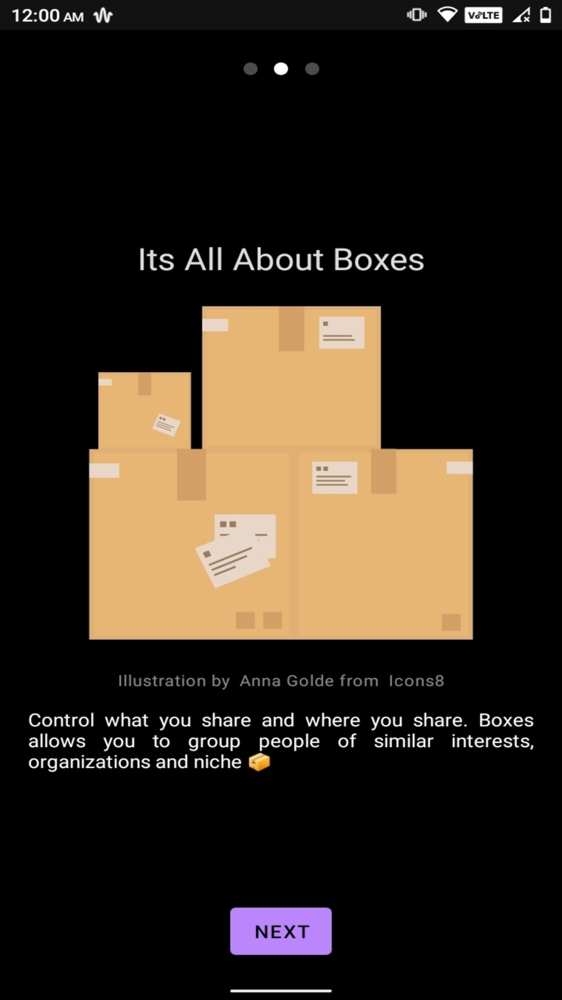
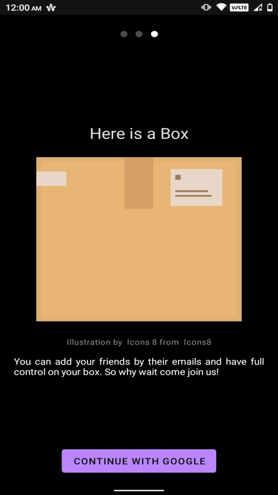
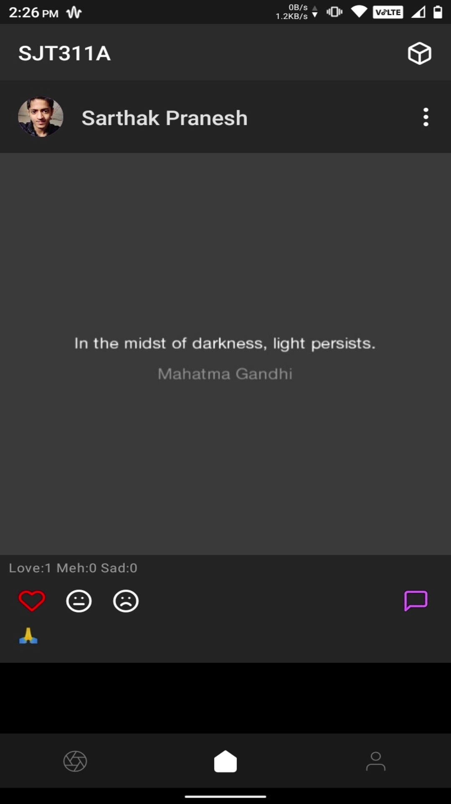
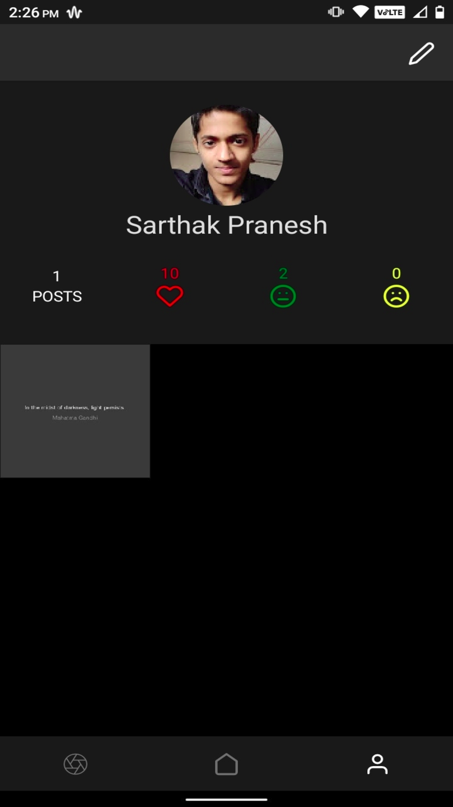
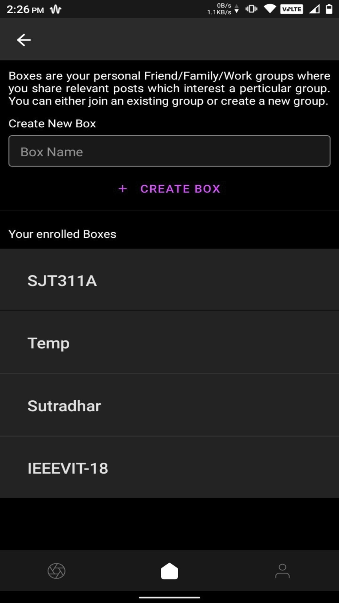
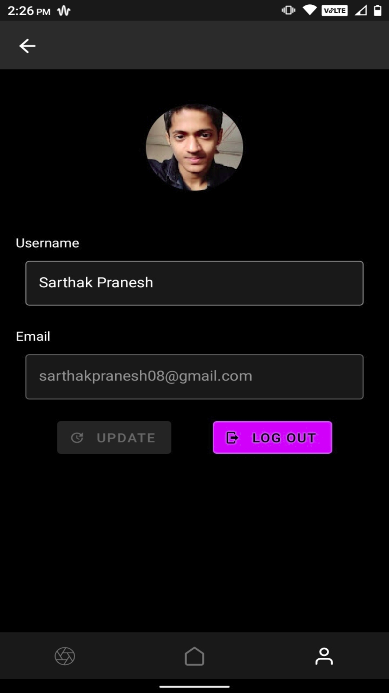
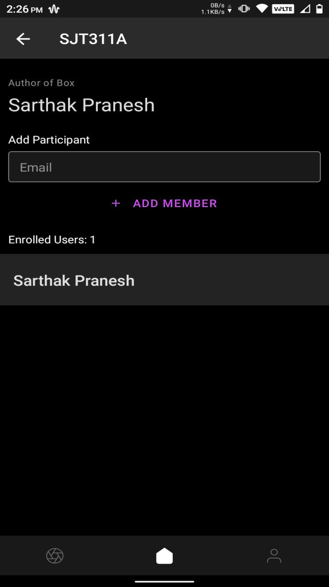

# Cosmos React-Native client

|   |   |   |
|---|---|---|
|   |   |   |
|   |   |   |
|   |   |   |

 

## What is Cosmos?

Cosmos is an open source Social Media platform. The project aims to provide a dedicated box like platform for it's users where they can have dedicated spaces for their  friends, family, work circle, etc. We achieve this by utilizing Boxes. Inside of each box you add users by there email that are relevant to that box. This helps you focus and share content in groups (boxes) where that content would matter the most.

 

## Download 
Latest Release: [Cosmos](https://github.com/sarthakpranesh/cosmos.ReactNative/releases)

 

## Future Features Plans
Review the `Latest Build` and let us know where we can improve, see future plans below and if you don't find your issue/feature request listed, open an issue.

|Feature Gist           |How to!            |Helps With         | 
|---	|---	|---	|
|Minimal Notifications   |The app would trigger notifications on specific events    |Lets the user know about the updates related to there posts   |
|Deep linking   |The app will allow to open links shared through other platforms    |Would allow the users to share links to posts on other platforms as well, and these links will be handled in the Cosmos app   |
|Sharing Api   |Call the standard share api provided by react native    |Will showcase multiple options to the user for sharing there posts on different platforms   |

 

## Having Any Issues?
This project uses [GitHub Issues](https://github.com/sarthakpranesh/cosmos.ReactNative/issues) to track bugs, feature request and more. So feel free to open issues and feature request if you find any 😉.
